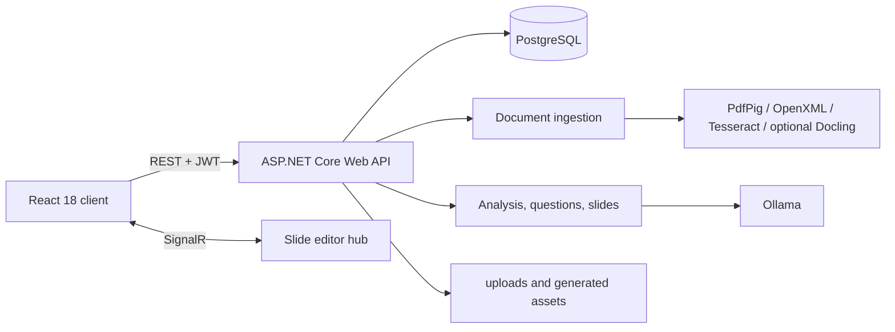

# PBL5 - AI Learning Workspace

PBL5 is a multilingual learning MVP that turns documents into structured content, question banks, study activities, and editable slides. It follows a local-first model built around ASP.NET Core, React, PostgreSQL, Ollama, Tesseract, and on-device document processors.

[Tiếng Việt](README.vi.md) · [日本語](README.ja.md) · [Language selector](README.md)

## Product flow

```text
Upload a document
  -> Text extraction / OCR
  -> Structure and content analysis
  -> Question Studio generation and review
  -> Quiz / Flashcards / Test / Streak
  -> Slide generation, editing, and export
```

Current product capabilities:

- **Workspaces and Sources:** create workspaces, upload multiple sources, and work inside one unified studio.
- **Document processing:** supports PDF, DOCX, and images through text-layer extraction, OpenXML, Tesseract OCR, and Poppler.
- **AI analysis:** builds topics, summaries, coverage, and grounded inputs for questions and slides through Ollama.
- **Question Studio V2:** runs generation in the background, supports pause/resume/cancel, draft review, editing, accept/reject/quarantine, and question-bank import.
- **Study Hub:** quiz, flashcards, test mode, streak mode, review queues, and learning-progress tracking.
- **Slide Studio:** generates decks from selected sources, reports job progress, edits and autosaves slides, collaborates through SignalR, and exports basic HTML, print/PDF, and PPTX.
- **Dashboard and analytics:** activity overview, personal progress, study history, and CSV exports.
- **Authentication and admin:** JWT registration/login, protected routes, and role-based administration.

## Architecture



Backend responsibilities are split as follows:

| Project | Responsibility |
| --- | --- |
| `src/ELearnGamePlatform.API` | Entrypoint, controllers, auth, DI, background job stores, uploads, and SignalR |
| `src/ELearnGamePlatform.Core` | Entities, enums, interfaces, options, and shared contracts |
| `src/ELearnGamePlatform.Infrastructure` | EF Core, PostgreSQL, migrations, repositories, and the Ollama client |
| `src/ELearnGamePlatform.Services` | OCR, document processing, AI analysis, question generation, and slide generation |
| `client` | React Router, Axios, i18n, Workspace Studio, Study Hub, and Slide Studio |
| `tests` | xUnit regression tests for important services and contracts |
| `benchmarks` | OCR benchmark runner and local benchmark data directories |

## Technology and versions

| Component | Current runtime |
| --- | --- |
| .NET SDK | `9.0.306`, pinned by `global.json` |
| Target framework | `net8.0` |
| Backend | ASP.NET Core Web API, EF Core 8, Npgsql, JWT, SignalR, Swagger |
| Frontend | React `18.2`, React Router `6.22`, Axios, Create React App |
| Node.js | Node.js 20 is used by the Docker build |
| Database | PostgreSQL 16 in Docker Compose |
| Local AI | Ollama with default model `qwen3:4b` |
| OCR | Tesseract 5 with `eng` and `vie`; Poppler `pdftoppm` for scanned PDFs |
| Slide export | HTML, print-friendly HTML, and basic PPTX through OpenXML |

## Prerequisites

A complete local environment requires:

- .NET SDK `9.0.306`.
- Node.js 20 and npm.
- PostgreSQL 16 or a compatible version.
- Ollama available at `http://localhost:11434`.
- The `qwen3:4b` model.
- Tesseract language data `eng.traineddata` and `vie.traineddata`.
- Poppler `pdftoppm` on `PATH`, or in a local Poppler directory detected by the service.
- Docker Desktop when running PostgreSQL/backend in containers.
- Python and Docling only when enabling the optional Docling parser.

Quick checks:

```powershell
dotnet --version
node --version
npm --version
ollama --version
psql --version
```

## Local development

### 1. Prepare PostgreSQL

Create a dedicated database and user, then keep the connection string outside source control:

```text
Host=localhost;Port=5432;Database=ELearnGameDB;Username=<db-user>;Password=<db-password>;SslMode=disable
```

PostgreSQL can be started by itself with Docker:

```powershell
Copy-Item .env.example .env
# Set POSTGRES_PASSWORD, JWT_SECRET, and ADMIN_PASSWORD in .env
docker compose up -d postgres
```

### 2. Prepare Ollama

```powershell
ollama pull qwen3:4b
ollama serve
```

Do not start another `ollama serve` process when Ollama is already running as a service.

### 3. Configure the backend safely

The API enables .NET User Secrets. Do not place real secrets in `appsettings.json`.

```powershell
dotnet user-secrets set "ConnectionStrings:DefaultConnection" "Host=localhost;Port=5432;Database=ELearnGameDB;Username=<db-user>;Password=<db-password>;SslMode=disable" --project src\ELearnGamePlatform.API
dotnet user-secrets set "JwtSettings:SecretKey" "<long-random-secret-at-least-32-characters>" --project src\ELearnGamePlatform.API
dotnet user-secrets set "AdminSeed:Enabled" "false" --project src\ELearnGamePlatform.API
```

To seed a local administrator, enable `AdminSeed:Enabled` and set its email/password through User Secrets instead of committing credentials.

.NET hierarchical environment variables use double underscores:

```powershell
$env:ConnectionStrings__DefaultConnection = "<connection-string>"
$env:JwtSettings__SecretKey = "<long-random-secret>"
$env:OllamaSettings__BaseUrl = "http://localhost:11434"
```

### 4. Start the API

```powershell
dotnet restore
dotnet run --project src\ELearnGamePlatform.API
```

- API: `http://localhost:5000`
- Swagger in Development: `http://localhost:5000/swagger`
- SignalR hub: `http://localhost:5000/hubs/slide-editor`

At startup, the API automatically applies pending EF Core migrations and validates critical columns. It stops when migration or schema validation fails.

### 5. Start the frontend

Open another terminal:

```powershell
Set-Location client
npm ci
npm start
```

- Frontend: `http://localhost:3000`
- The development client calls `http://localhost:5000/api`.

After registration or login, the primary flow starts at `/workspaces`. `/documents` and `/folders` remain compatibility redirects only.

## Uploads, OCR, and Docling

The backend accepts:

| Format | Primary pipeline |
| --- | --- |
| `.pdf` | PdfPig text layer; scanned pages may be rendered with Poppler and processed by Tesseract |
| `.docx` | OpenXML |
| `.png`, `.jpg`, `.jpeg` | Tesseract OCR |

The default limit is `50 MB`, configured through `FileUpload.MaxFileSizeInMB`.

Docling is optional and disabled by default:

```powershell
python -m pip install docling
docling --help
$env:DocumentParsing__Enabled = "true"
dotnet run --project src\ELearnGamePlatform.API
```

The legacy extraction pipeline always runs first. With `DocumentParsing.FallbackToLegacy=true`, command failures, timeouts, short Markdown, or encoding failures fall back to legacy text instead of failing ingestion. Valid Markdown is retained under `uploads/parsed`. See [Document Parsing with Docling](docs/guides/DOCUMENT_PARSING.md).

## Important configuration

| Section | Purpose |
| --- | --- |
| `ConnectionStrings.DefaultConnection` | PostgreSQL connection |
| `JwtSettings` | Issuer, audience, secret, and token lifetime |
| `AdminSeed` | Optional administrator seed at startup |
| `OllamaSettings` | Base URL, models, timeouts, temperatures, and context |
| `LocalLlmSettings` | Token budgets, chunking, and analysis profile |
| `OcrSettings` | DPI, retry, quality thresholds, and preprocessing |
| `DocumentParsing` | Docling CLI, timeout, fallback, and Markdown output |
| `DocumentUnderstanding` | Optional layout, vision, and table analysis |
| `FileUpload` | File-size and extension allowlist |
| `ImagePipeline` | Planning, web sources, reranking, review, and image fallback |
| `Cors.AllowedOrigins` | Frontend origins allowed to call the API |

OpenAI image generation is only an image-pipeline fallback and requires `OPENAI_API_KEY`. The key is not required for upload, OCR, Ollama, question generation, or basic text-based slide generation.

## Docker

Create the environment file:

```powershell
Copy-Item .env.example .env
```

Fill in its placeholders, then run:

```powershell
docker compose up -d --build
docker compose ps
```

Current services:

| Service | URL/port |
| --- | --- |
| PostgreSQL | `localhost:5432` |
| Backend | `http://localhost:5000` |
| Frontend nginx | `http://localhost:8080` |

Important notes:

- The backend container reaches host Ollama through `http://host.docker.internal:11434`.
- `docker-compose.yml` currently builds the frontend against the production API `https://pbl5-api.danangtoiiu.live`.
- Default CORS does not include `http://localhost:8080`; the current Compose setup is therefore deployment-oriented rather than a complete local stack.
- For local development, the reliable setup is PostgreSQL or backend in Docker plus the React development server on port `3000`.
- `docker-compose.cloudflare.yml` and the [Cloudflare deployment guide](docs/guides/cloudflare-tunnel-test-deploy.md) cover tunnel deployment.

Stop the stack:

```powershell
docker compose down
```

Do not add `-v` when PostgreSQL and upload volumes must be preserved.

## Build and test

```powershell
dotnet build ELearnGamePlatform.sln
dotnet test tests\ELearnGamePlatform.Services.Tests\ELearnGamePlatform.Services.Tests.csproj

Set-Location client
npm run build
npm test -- --watchAll=false
```

OCR benchmark:

```powershell
dotnet run --project benchmarks\OcrBenchmark
```

Place local benchmark inputs in `benchmarks/input-documents`; results are written to `benchmarks/output`.

## Runtime data

- Uploaded files and parsed Markdown live under `src/ELearnGamePlatform.API/uploads` when running from the project, or `/app/uploads` in the container volume.
- Slide images and assets are served from static-file or upload directories.
- Document, question, and slide background job state is currently held in memory; restarting the API can lose active job state.
- Business data is stored in PostgreSQL through EF Core; several advanced metadata fields use JSON/JSONB.

## Current limitations

- Docling and advanced Document Understanding are disabled by default; legacy extraction/OCR remains the baseline.
- Vision analysis requires a separate vision model when enabled.
- PPTX export is basic, is not pixel-perfect with the HTML/editor output, and does not preserve every presentation capability.
- “Save as PDF” uses print-friendly HTML and the browser print dialog, not a backend-rendered PDF binary.
- Slide image web search depends on external sources; OpenAI image generation only runs when configured and selected as a fallback.
- In-memory job stores are not suitable for multiple API instances or mid-job restarts.
- The repository has no reliably maintained product screenshots, so runtime assets are not presented as product imagery here.

## Troubleshooting

### The API stops during startup

Check PostgreSQL, the connection string, and migrations:

```powershell
dotnet tool restore
dotnet ef migrations list --project src\ELearnGamePlatform.Infrastructure --startup-project src\ELearnGamePlatform.API
```

### Ollama does not respond

```powershell
ollama list
ollama run qwen3:4b
```

Confirm `OllamaSettings.BaseUrl` is `http://localhost:11434`, or uses `host.docker.internal` when the API runs in a container.

### Scanned PDF OCR returns empty text

Check `pdftoppm` and the language data:

```powershell
pdftoppm -h
Get-ChildItem src\ELearnGamePlatform.API\tessdata
```

### The frontend reports CORS errors or calls the wrong API

Development defaults to `http://localhost:5000`. For production builds, set `REACT_APP_API_BASE_URL` before building and add the matching frontend origin to `Cors.AllowedOrigins`.

### Docling does not run

```powershell
Get-Command docling
python -m pip show docling
docling --help
```

Keep `DocumentParsing.FallbackToLegacy=true` so ingestion continues when the external parser fails.

## Technical documentation

- [Architecture](docs/guides/ARCHITECTURE.md)
- [Development guide](docs/guides/DEVELOPMENT.md)
- [Document Parsing with Docling](docs/guides/DOCUMENT_PARSING.md)
- [Learning progress and Test Mode](docs/guides/LEARNING_PROGRESS.md)
- [Slide export](docs/guides/SLIDE_EXPORT.md)
- [OCR benchmark](docs/guides/OCR_BENCHMARK.md)
- [PostgreSQL migration](docs/guides/POSTGRESQL_MIGRATION.md)
- [Cloudflare tunnel deployment](docs/guides/cloudflare-tunnel-test-deploy.md)

## Source of truth

This README describes the runtime state at the time of its update. When documentation and code differ, prefer the active `Program.cs`, project manifests, `appsettings.json`, EF migrations, controllers/services, and frontend consumers.
