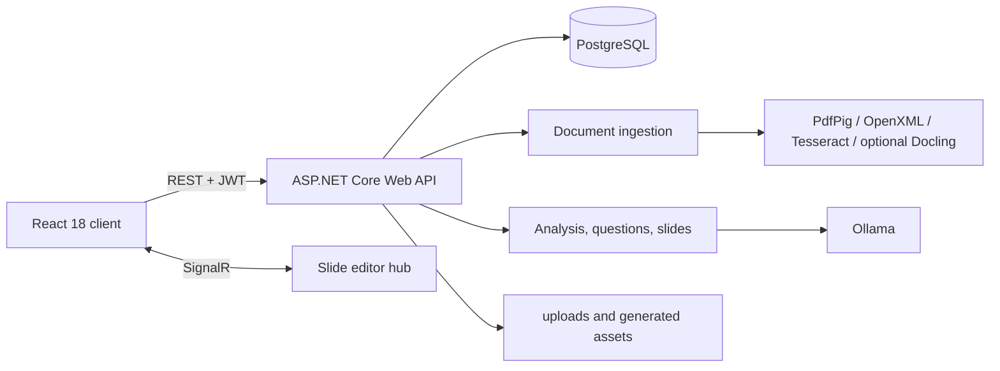

# PBL5 - AI 学習ワークスペース

PBL5 は、ドキュメントを構造化コンテンツ、問題バンク、学習アクティビティ、編集可能なスライドへ変換する多言語学習 MVP です。ASP.NET Core、React、PostgreSQL、Ollama、Tesseract、およびローカルのドキュメント処理を中心とした local-first 構成です。

[Tiếng Việt](README.vi.md) · [English](README.en.md) · [言語選択](README.md)

## プロダクトフロー

```text
ドキュメントをアップロード
  -> テキスト抽出 / OCR
  -> 構造・内容分析
  -> Question Studio で問題を生成・レビュー
  -> Quiz / Flashcards / Test / Streak
  -> スライドを生成・編集・エクスポート
```

現在実装されている主な機能:

- **Workspace と Source:** workspace を作成し、複数の source をアップロードして統合 studio で作業できます。
- **ドキュメント処理:** PDF、DOCX、画像に対応し、text layer、OpenXML、Tesseract OCR、Poppler を使用します。
- **AI analysis:** Ollama により topic、summary、coverage、問題・スライド用の根拠データを作成します。
- **Question Studio V2:** background generation、pause/resume/cancel、draft のレビュー・編集、accept/reject/quarantine、question bank への import に対応します。
- **Study Hub:** quiz、flashcards、test mode、streak mode、review queue、学習進捗を提供します。
- **Slide Studio:** 選択した source から deck を生成し、job progress、編集、autosave、SignalR によるリアルタイム連携、HTML・print/PDF・基本 PPTX export を提供します。
- **Dashboard と analytics:** 活動概要、個人進捗、学習履歴、CSV export を提供します。
- **Auth と admin:** JWT による登録・ログイン、protected route、role ベースの管理画面を備えます。

## アーキテクチャ



Backend の責務:

| Project | 責務 |
| --- | --- |
| `src/ELearnGamePlatform.API` | Entrypoint、controller、auth、DI、background job store、upload、SignalR |
| `src/ELearnGamePlatform.Core` | Entity、enum、interface、option、共通 contract |
| `src/ELearnGamePlatform.Infrastructure` | EF Core、PostgreSQL、migration、repository、Ollama client |
| `src/ELearnGamePlatform.Services` | OCR、document processing、AI analysis、question generation、slide generation |
| `client` | React Router、Axios、i18n、Workspace Studio、Study Hub、Slide Studio |
| `tests` | 重要な service と contract の xUnit regression test |
| `benchmarks` | OCR benchmark runner とローカル benchmark data |

## 技術とバージョン

| Component | 現在の runtime |
| --- | --- |
| .NET SDK | `global.json` で固定された `9.0.306` |
| Target framework | `net8.0` |
| Backend | ASP.NET Core Web API、EF Core 8、Npgsql、JWT、SignalR、Swagger |
| Frontend | React `18.2`、React Router `6.22`、Axios、Create React App |
| Node.js | Docker build では Node.js 20 |
| Database | Docker Compose では PostgreSQL 16 |
| Local AI | Ollama、default model `qwen3:4b` |
| OCR | Tesseract 5 の `eng` と `vie`、scan PDF 用 Poppler `pdftoppm` |
| Slide export | HTML、print-friendly HTML、OpenXML による基本 PPTX |

## 必要環境

完全なローカル環境には以下が必要です。

- .NET SDK `9.0.306`
- Node.js 20 と npm
- PostgreSQL 16 または互換バージョン
- `http://localhost:11434` で動作する Ollama
- `qwen3:4b` model
- Tesseract language data の `eng.traineddata` と `vie.traineddata`
- `PATH` 上の Poppler `pdftoppm`、または service が検出できるローカル Poppler directory
- PostgreSQL/backend を container で実行する場合は Docker Desktop
- optional Docling parser を有効にする場合のみ Python と Docling

確認コマンド:

```powershell
dotnet --version
node --version
npm --version
ollama --version
psql --version
```

## ローカル実行

### 1. PostgreSQL の準備

専用 database と user を作成し、connection string は source control の外で管理します。

```text
Host=localhost;Port=5432;Database=ELearnGameDB;Username=<db-user>;Password=<db-password>;SslMode=disable
```

PostgreSQL のみ Docker で起動できます。

```powershell
Copy-Item .env.example .env
# .env に POSTGRES_PASSWORD、JWT_SECRET、ADMIN_PASSWORD を設定
docker compose up -d postgres
```

### 2. Ollama の準備

```powershell
ollama pull qwen3:4b
ollama serve
```

Ollama が service として起動済みの場合、別の `ollama serve` は不要です。

### 3. Backend の安全な設定

API は .NET User Secrets に対応しています。実際の secret を `appsettings.json` に追加しないでください。

```powershell
dotnet user-secrets set "ConnectionStrings:DefaultConnection" "Host=localhost;Port=5432;Database=ELearnGameDB;Username=<db-user>;Password=<db-password>;SslMode=disable" --project src\ELearnGamePlatform.API
dotnet user-secrets set "JwtSettings:SecretKey" "<long-random-secret-at-least-32-characters>" --project src\ELearnGamePlatform.API
dotnet user-secrets set "AdminSeed:Enabled" "false" --project src\ELearnGamePlatform.API
```

ローカル admin を seed する場合は `AdminSeed:Enabled` を有効にし、email/password を User Secrets で設定します。

.NET の階層型 environment variable は二重 underscore を使用します。

```powershell
$env:ConnectionStrings__DefaultConnection = "<connection-string>"
$env:JwtSettings__SecretKey = "<long-random-secret>"
$env:OllamaSettings__BaseUrl = "http://localhost:11434"
```

### 4. API の起動

```powershell
dotnet restore
dotnet run --project src\ELearnGamePlatform.API
```

- API: `http://localhost:5000`
- Development 環境の Swagger: `http://localhost:5000/swagger`
- SignalR hub: `http://localhost:5000/hubs/slide-editor`

起動時に API は未適用の EF Core migration を自動適用し、重要な column を検証します。Migration または schema が不正な場合は起動を停止します。

### 5. Frontend の起動

別の terminal を開きます。

```powershell
Set-Location client
npm ci
npm start
```

- Frontend: `http://localhost:3000`
- Development client は `http://localhost:5000/api` を呼び出します。

登録またはログイン後の主要フローは `/workspaces` から始まります。`/documents` と `/folders` は互換 redirect のみです。

## Upload、OCR、Docling

Backend が受け付ける形式:

| Format | 主な pipeline |
| --- | --- |
| `.pdf` | PdfPig text layer。scan page は Poppler で render し、Tesseract で処理可能 |
| `.docx` | OpenXML |
| `.png`, `.jpg`, `.jpeg` | Tesseract OCR |

Default limit は `50 MB` で、`FileUpload.MaxFileSizeInMB` から設定します。

Docling は optional で、default では無効です。

```powershell
python -m pip install docling
docling --help
$env:DocumentParsing__Enabled = "true"
dotnet run --project src\ELearnGamePlatform.API
```

Legacy extraction は常に先に実行されます。`DocumentParsing.FallbackToLegacy=true` の場合、command failure、timeout、短すぎる Markdown、encoding failure が発生しても ingestion を失敗させず legacy text に戻ります。有効な Markdown は `uploads/parsed` に保存されます。詳細は [Document Parsing with Docling](docs/guides/DOCUMENT_PARSING.md) を参照してください。

## 重要な設定

| Section | 用途 |
| --- | --- |
| `ConnectionStrings.DefaultConnection` | PostgreSQL connection |
| `JwtSettings` | Issuer、audience、secret、token lifetime |
| `AdminSeed` | Startup 時の optional admin seed |
| `OllamaSettings` | Base URL、model、timeout、temperature、context |
| `LocalLlmSettings` | Token budget、chunking、analysis profile |
| `OcrSettings` | DPI、retry、quality threshold、preprocessing |
| `DocumentParsing` | Docling CLI、timeout、fallback、Markdown output |
| `DocumentUnderstanding` | Optional layout、vision、table analysis |
| `FileUpload` | File size と extension allowlist |
| `ImagePipeline` | Planning、web source、rerank、review、image fallback |
| `Cors.AllowedOrigins` | API を呼び出せる frontend origin |

OpenAI image generation は image pipeline の fallback のみで、`OPENAI_API_KEY` が必要です。Upload、OCR、Ollama、question generation、基本的な text slide generation には必要ありません。

## Docker

Environment file を作成します。

```powershell
Copy-Item .env.example .env
```

Placeholder を設定して実行します。

```powershell
docker compose up -d --build
docker compose ps
```

現在の service:

| Service | URL/port |
| --- | --- |
| PostgreSQL | `localhost:5432` |
| Backend | `http://localhost:5000` |
| Frontend nginx | `http://localhost:8080` |

重要な注意:

- Backend container は host の Ollama に `http://host.docker.internal:11434` で接続します。
- `docker-compose.yml` は現在 frontend を production API `https://pbl5-api.danangtoiiu.live` 向けに build します。
- Default CORS に `http://localhost:8080` は含まれないため、現在の Compose は完全な local stack より deployment 向けです。
- Local development では PostgreSQL または backend を Docker で実行し、React development server を port `3000` で実行する構成が安定しています。
- `docker-compose.cloudflare.yml` と [Cloudflare deployment guide](docs/guides/cloudflare-tunnel-test-deploy.md) は tunnel deployment 用です。

Stack の停止:

```powershell
docker compose down
```

PostgreSQL と upload volume を保持する場合は `-v` を追加しないでください。

## Build と test

```powershell
dotnet build ELearnGamePlatform.sln
dotnet test tests\ELearnGamePlatform.Services.Tests\ELearnGamePlatform.Services.Tests.csproj

Set-Location client
npm run build
npm test -- --watchAll=false
```

OCR benchmark:

```powershell
dotnet run --project benchmarks\OcrBenchmark
```

Local benchmark input は `benchmarks/input-documents` に置き、結果は `benchmarks/output` に出力されます。

## Runtime data

- Project から実行する場合、upload file と parsed Markdown は `src/ELearnGamePlatform.API/uploads` に保存されます。Container では `/app/uploads` volume を使用します。
- Slide image と asset は static-file または upload directory から配信されます。
- Document、question、slide の background job state は現在 memory 内に保持されます。API restart で active job state が失われる場合があります。
- 業務データは EF Core を通して PostgreSQL に保存され、高度な metadata の一部は JSON/JSONB を使用します。

## 現在の制限

- Docling と高度な Document Understanding は default で無効であり、legacy extraction/OCR が baseline です。
- Vision analysis を有効にする場合は別の vision model が必要です。
- PPTX export は基本版であり、HTML/editor と pixel-perfect ではなく、すべての presentation 機能を保持しません。
- “Save as PDF” は backend が生成する PDF binary ではなく、print-friendly HTML と browser print dialog を使用します。
- Slide image web search は外部 source に依存します。OpenAI image generation は設定され fallback に選ばれた場合のみ実行されます。
- In-memory job store は複数 API instance や job 途中の restart には適していません。
- Repo 内に継続管理された信頼できる product screenshot がないため、runtime asset を product image として使用していません。

## Troubleshooting

### API が startup 中に停止する

PostgreSQL、connection string、migration を確認します。

```powershell
dotnet tool restore
dotnet ef migrations list --project src\ELearnGamePlatform.Infrastructure --startup-project src\ELearnGamePlatform.API
```

### Ollama が応答しない

```powershell
ollama list
ollama run qwen3:4b
```

`OllamaSettings.BaseUrl` が `http://localhost:11434`、API が container 内の場合は `host.docker.internal` を使用していることを確認します。

### Scan PDF の OCR text が空になる

`pdftoppm` と language data を確認します。

```powershell
pdftoppm -h
Get-ChildItem src\ELearnGamePlatform.API\tessdata
```

### Frontend で CORS error、または誤った API を呼び出す

Development default は `http://localhost:5000` です。Production build では build 前に `REACT_APP_API_BASE_URL` を設定し、対応する frontend origin を `Cors.AllowedOrigins` に追加します。

### Docling が動作しない

```powershell
Get-Command docling
python -m pip show docling
docling --help
```

External parser の失敗時も ingestion を継続するには `DocumentParsing.FallbackToLegacy=true` を維持します。

## 技術ドキュメント

- [Architecture](docs/guides/ARCHITECTURE.md)
- [Development guide](docs/guides/DEVELOPMENT.md)
- [Document Parsing with Docling](docs/guides/DOCUMENT_PARSING.md)
- [Learning progress and Test Mode](docs/guides/LEARNING_PROGRESS.md)
- [Slide export](docs/guides/SLIDE_EXPORT.md)
- [OCR benchmark](docs/guides/OCR_BENCHMARK.md)
- [PostgreSQL migration](docs/guides/POSTGRESQL_MIGRATION.md)
- [Cloudflare tunnel deployment](docs/guides/cloudflare-tunnel-test-deploy.md)

## Source of truth

この README は更新時点の runtime 状態を説明します。Documentation と code が異なる場合は、実行中の `Program.cs`、project manifest、`appsettings.json`、EF migration、controller/service、frontend consumer を優先してください。
