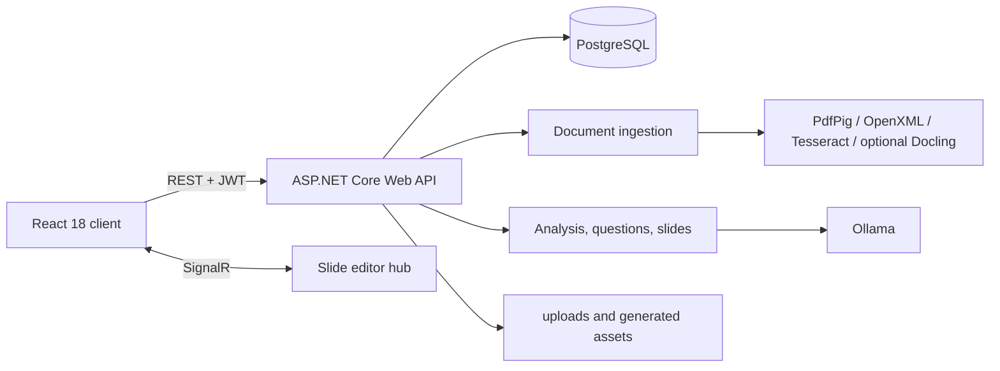

# PBL5 - Không gian học tập với AI

PBL5 là MVP học tập đa ngôn ngữ, biến tài liệu thành nội dung có cấu trúc, ngân hàng câu hỏi, hoạt động ôn tập và slide có thể chỉnh sửa. Hệ thống chạy theo mô hình local-first với ASP.NET Core, React, PostgreSQL, Ollama, Tesseract và các bộ xử lý tài liệu tại máy.

[English](README.en.md) · [日本語](README.ja.md) · [Chọn ngôn ngữ](README.md)

## Luồng sản phẩm

```text
Tải tài liệu lên
  -> Trích xuất text / OCR
  -> Phân tích cấu trúc và nội dung
  -> Question Studio tạo và kiểm duyệt câu hỏi
  -> Quiz / Flashcards / Test / Streak
  -> Tạo, chỉnh sửa và xuất slide
```

Các luồng chính hiện có:

- **Workspace và Source:** tạo workspace, tải nhiều source và làm việc trong một studio thống nhất.
- **Xử lý tài liệu:** hỗ trợ PDF, DOCX và ảnh; kết hợp text layer, OpenXML, Tesseract OCR và Poppler.
- **AI analysis:** xây dựng topic, summary, coverage và dữ liệu nền cho câu hỏi hoặc slide bằng Ollama.
- **Question Studio V2:** chạy generation ở background, tạm dừng/tiếp tục/hủy, duyệt draft, chỉnh sửa, accept/reject/quarantine và import vào question bank.
- **Study Hub:** quiz, flashcards, test mode, streak mode, review queue và theo dõi tiến độ.
- **Slide Studio:** tạo deck từ source đã chọn, theo dõi job, chỉnh sửa slide, autosave, cộng tác realtime qua SignalR và xuất HTML, print/PDF hoặc PPTX cơ bản.
- **Dashboard và analytics:** tổng quan hoạt động, tiến độ cá nhân, lịch sử học và CSV export.
- **Auth và admin:** đăng ký, đăng nhập bằng JWT, route bảo vệ và trang quản trị theo role.

## Kiến trúc



Backend được chia theo trách nhiệm:

| Project | Vai trò |
| --- | --- |
| `src/ELearnGamePlatform.API` | Entrypoint, controller, auth, DI, background job store, upload và SignalR |
| `src/ELearnGamePlatform.Core` | Entity, enum, interface, option và contract dùng chung |
| `src/ELearnGamePlatform.Infrastructure` | EF Core, PostgreSQL, migration, repository và Ollama client |
| `src/ELearnGamePlatform.Services` | OCR, document processing, AI analysis, question generation và slide generation |
| `client` | React Router, Axios, i18n, Workspace Studio, Study Hub và Slide Studio |
| `tests` | xUnit regression tests cho service và contract quan trọng |
| `benchmarks` | OCR benchmark runner và thư mục dữ liệu benchmark local |

## Công nghệ và phiên bản

| Thành phần | Runtime hiện tại |
| --- | --- |
| .NET SDK | `9.0.306`, được pin bởi `global.json` |
| Target framework | `net8.0` |
| Backend | ASP.NET Core Web API, EF Core 8, Npgsql, JWT, SignalR, Swagger |
| Frontend | React `18.2`, React Router `6.22`, Axios, Create React App |
| Node.js | Node.js 20 được dùng trong Docker build |
| Database | PostgreSQL 16 trong Docker Compose |
| Local AI | Ollama, model mặc định `qwen3:4b` |
| OCR | Tesseract 5 với `eng` và `vie`; Poppler `pdftoppm` cho PDF scan |
| Slide export | HTML, print-friendly HTML và PPTX cơ bản bằng OpenXML |

## Yêu cầu

Để chạy local đầy đủ:

- .NET SDK `9.0.306`.
- Node.js 20 và npm.
- PostgreSQL 16 hoặc phiên bản tương thích.
- Ollama đang chạy tại `http://localhost:11434`.
- Model `qwen3:4b`.
- Tesseract language data `eng.traineddata` và `vie.traineddata`.
- Poppler `pdftoppm` trong `PATH`, hoặc thư mục Poppler local mà service có thể phát hiện.
- Docker Desktop nếu dùng PostgreSQL/backend bằng container.
- Python và Docling chỉ khi bật parser Docling tùy chọn.

Kiểm tra nhanh:

```powershell
dotnet --version
node --version
npm --version
ollama --version
psql --version
```

## Chạy local

### 1. Chuẩn bị PostgreSQL

Tạo database và user riêng, sau đó giữ connection string ngoài source control. Ví dụ:

```text
Host=localhost;Port=5432;Database=ELearnGameDB;Username=<db-user>;Password=<db-password>;SslMode=disable
```

Có thể chỉ chạy PostgreSQL bằng Docker:

```powershell
Copy-Item .env.example .env
# Điền POSTGRES_PASSWORD, JWT_SECRET và ADMIN_PASSWORD trong .env
docker compose up -d postgres
```

### 2. Chuẩn bị Ollama

```powershell
ollama pull qwen3:4b
ollama serve
```

Nếu Ollama đã chạy dưới dạng service thì không cần chạy lại `ollama serve`.

### 3. Cấu hình backend an toàn

API đã bật .NET User Secrets. Không đưa secret thật vào `appsettings.json`.

```powershell
dotnet user-secrets set "ConnectionStrings:DefaultConnection" "Host=localhost;Port=5432;Database=ELearnGameDB;Username=<db-user>;Password=<db-password>;SslMode=disable" --project src\ELearnGamePlatform.API
dotnet user-secrets set "JwtSettings:SecretKey" "<long-random-secret-at-least-32-characters>" --project src\ELearnGamePlatform.API
dotnet user-secrets set "AdminSeed:Enabled" "false" --project src\ELearnGamePlatform.API
```

Nếu cần seed tài khoản admin local, bật `AdminSeed:Enabled` và đặt email/password qua User Secrets thay vì commit credential.

Các biến môi trường dùng cú pháp phân cấp .NET:

```powershell
$env:ConnectionStrings__DefaultConnection = "<connection-string>"
$env:JwtSettings__SecretKey = "<long-random-secret>"
$env:OllamaSettings__BaseUrl = "http://localhost:11434"
```

### 4. Khởi động API

```powershell
dotnet restore
dotnet run --project src\ELearnGamePlatform.API
```

- API: `http://localhost:5000`
- Swagger trong môi trường Development: `http://localhost:5000/swagger`
- SignalR hub: `http://localhost:5000/hubs/slide-editor`

Khi khởi động, API tự áp dụng EF Core migration còn thiếu và kiểm tra các column quan trọng. API dừng nếu migration hoặc schema không hợp lệ.

### 5. Khởi động frontend

Mở terminal khác:

```powershell
Set-Location client
npm ci
npm start
```

- Frontend: `http://localhost:3000`
- Dev client gọi API tại `http://localhost:5000/api`.

Sau khi đăng ký hoặc đăng nhập, luồng chính bắt đầu tại `/workspaces`. Các route `/documents` và `/folders` chỉ còn redirect tương thích.

## Upload, OCR và Docling

Backend chấp nhận:

| Định dạng | Pipeline chính |
| --- | --- |
| `.pdf` | PdfPig text layer; trang scan có thể render bằng Poppler và OCR bằng Tesseract |
| `.docx` | OpenXML |
| `.png`, `.jpg`, `.jpeg` | Tesseract OCR |

Giới hạn mặc định là `50 MB`, cấu hình tại `FileUpload.MaxFileSizeInMB`.

Docling là parser tùy chọn và mặc định tắt:

```powershell
python -m pip install docling
docling --help
$env:DocumentParsing__Enabled = "true"
dotnet run --project src\ELearnGamePlatform.API
```

Pipeline luôn chạy legacy extraction trước. Khi `DocumentParsing.FallbackToLegacy=true`, lỗi command, timeout, Markdown quá ngắn hoặc lỗi encoding sẽ quay về text legacy thay vì làm hỏng ingestion. Markdown hợp lệ được lưu dưới `uploads/parsed`. Xem [Document Parsing with Docling](docs/guides/DOCUMENT_PARSING.md).

## Cấu hình quan trọng

| Section | Mục đích |
| --- | --- |
| `ConnectionStrings.DefaultConnection` | Kết nối PostgreSQL |
| `JwtSettings` | Issuer, audience, secret và thời hạn token |
| `AdminSeed` | Seed admin tùy chọn khi startup |
| `OllamaSettings` | Base URL, model, timeout, temperature và context |
| `LocalLlmSettings` | Token budget, chunking và profile phân tích |
| `OcrSettings` | DPI, retry, quality threshold và preprocessing |
| `DocumentParsing` | Docling CLI, timeout, fallback và output Markdown |
| `DocumentUnderstanding` | Layout/vision/table analysis tùy chọn |
| `FileUpload` | Dung lượng và extension được phép |
| `ImagePipeline` | Planning, web source, rerank, review và image fallback |
| `Cors.AllowedOrigins` | Origin frontend được phép gọi API |

Image generation qua OpenAI chỉ là fallback của image pipeline và cần `OPENAI_API_KEY`. Không cần key này cho luồng upload, OCR, Ollama, question hoặc slide text cơ bản.

## Docker

Tạo file môi trường:

```powershell
Copy-Item .env.example .env
```

Điền các placeholder trong `.env`, sau đó:

```powershell
docker compose up -d --build
docker compose ps
```

Service hiện tại:

| Service | URL/port |
| --- | --- |
| PostgreSQL | `localhost:5432` |
| Backend | `http://localhost:5000` |
| Frontend nginx | `http://localhost:8080` |

Lưu ý quan trọng:

- Backend container gọi Ollama trên máy host qua `http://host.docker.internal:11434`.
- `docker-compose.yml` hiện build frontend với API production `https://pbl5-api.danangtoiiu.live`.
- CORS mặc định không gồm `http://localhost:8080`; vì vậy cấu hình Compose hiện phù hợp deployment hơn local full-stack.
- Với development local, cách ổn định là chạy `postgres` hoặc `backend` bằng Docker và chạy frontend bằng `npm start` tại cổng `3000`.
- `docker-compose.cloudflare.yml` và [Cloudflare deployment guide](docs/guides/cloudflare-tunnel-test-deploy.md) dành cho deployment qua tunnel.

Dừng stack:

```powershell
docker compose down
```

Không thêm `-v` nếu muốn giữ volume PostgreSQL và uploads.

## Build và test

```powershell
dotnet build ELearnGamePlatform.sln
dotnet test tests\ELearnGamePlatform.Services.Tests\ELearnGamePlatform.Services.Tests.csproj

Set-Location client
npm run build
npm test -- --watchAll=false
```

OCR benchmark:

```powershell
dotnet run --project benchmarks\OcrBenchmark
```

Đặt dữ liệu benchmark local trong `benchmarks/input-documents`; output được ghi vào `benchmarks/output`.

## Dữ liệu runtime

- File upload và Markdown đã parse: `src/ELearnGamePlatform.API/uploads` khi chạy từ project, hoặc volume `/app/uploads` trong container.
- Slide images và asset được phục vụ từ static files hoặc thư mục upload.
- Background job state cho document, question và slide hiện được giữ trong memory; restart API có thể làm mất job state đang chạy.
- Dữ liệu nghiệp vụ được lưu trong PostgreSQL qua EF Core; nhiều metadata nâng cao dùng JSON/JSONB.

## Giới hạn hiện tại

- Docling và Document Understanding nâng cao mặc định tắt; legacy extraction/OCR vẫn là baseline.
- Vision analysis cần model vision riêng khi được bật.
- PPTX export là bản cơ bản, chưa pixel-perfect như HTML/editor và chưa giữ đầy đủ mọi khả năng trình bày.
- “Save as PDF” dùng print-friendly HTML và hộp thoại in của browser, không phải PDF binary do backend render.
- Slide image web search phụ thuộc nguồn ngoài; OpenAI image generation chỉ chạy khi có key và được chọn làm fallback.
- Job store in-memory chưa phù hợp cho nhiều API instance hoặc restart giữa chừng.
- Không có screenshot sản phẩm được duy trì đủ tin cậy trong repo; README không dùng asset runtime làm ảnh minh họa.

## Xử lý lỗi thường gặp

### API dừng khi startup

Kiểm tra PostgreSQL, connection string và migration:

```powershell
dotnet tool restore
dotnet ef migrations list --project src\ELearnGamePlatform.Infrastructure --startup-project src\ELearnGamePlatform.API
```

### Ollama không phản hồi

```powershell
ollama list
ollama run qwen3:4b
```

Xác nhận `OllamaSettings.BaseUrl` trỏ đúng `http://localhost:11434`, hoặc `host.docker.internal` khi API ở trong container.

### OCR PDF scan trả text rỗng

Kiểm tra `pdftoppm` và language data:

```powershell
pdftoppm -h
Get-ChildItem src\ELearnGamePlatform.API\tessdata
```

### Frontend nhận lỗi CORS hoặc gọi sai API

Development mặc định dùng `http://localhost:5000`. Với production build, đặt `REACT_APP_API_BASE_URL` trước khi build và thêm origin frontend tương ứng vào `Cors.AllowedOrigins`.

### Docling không chạy

```powershell
Get-Command docling
python -m pip show docling
docling --help
```

Giữ `DocumentParsing.FallbackToLegacy=true` để ingestion vẫn tiếp tục khi parser ngoài gặp lỗi.

## Tài liệu kỹ thuật

- [Kiến trúc](docs/guides/ARCHITECTURE.md)
- [Development guide](docs/guides/DEVELOPMENT.md)
- [Document Parsing with Docling](docs/guides/DOCUMENT_PARSING.md)
- [Learning progress và Test Mode](docs/guides/LEARNING_PROGRESS.md)
- [Slide export](docs/guides/SLIDE_EXPORT.md)
- [OCR benchmark](docs/guides/OCR_BENCHMARK.md)
- [PostgreSQL migration](docs/guides/POSTGRESQL_MIGRATION.md)
- [Cloudflare tunnel deployment](docs/guides/cloudflare-tunnel-test-deploy.md)

## Nguồn sự thật

README mô tả trạng thái runtime tại thời điểm cập nhật. Khi tài liệu và code khác nhau, ưu tiên `Program.cs`, project manifest, `appsettings.json`, EF migrations, controller/service và frontend consumer đang chạy.
