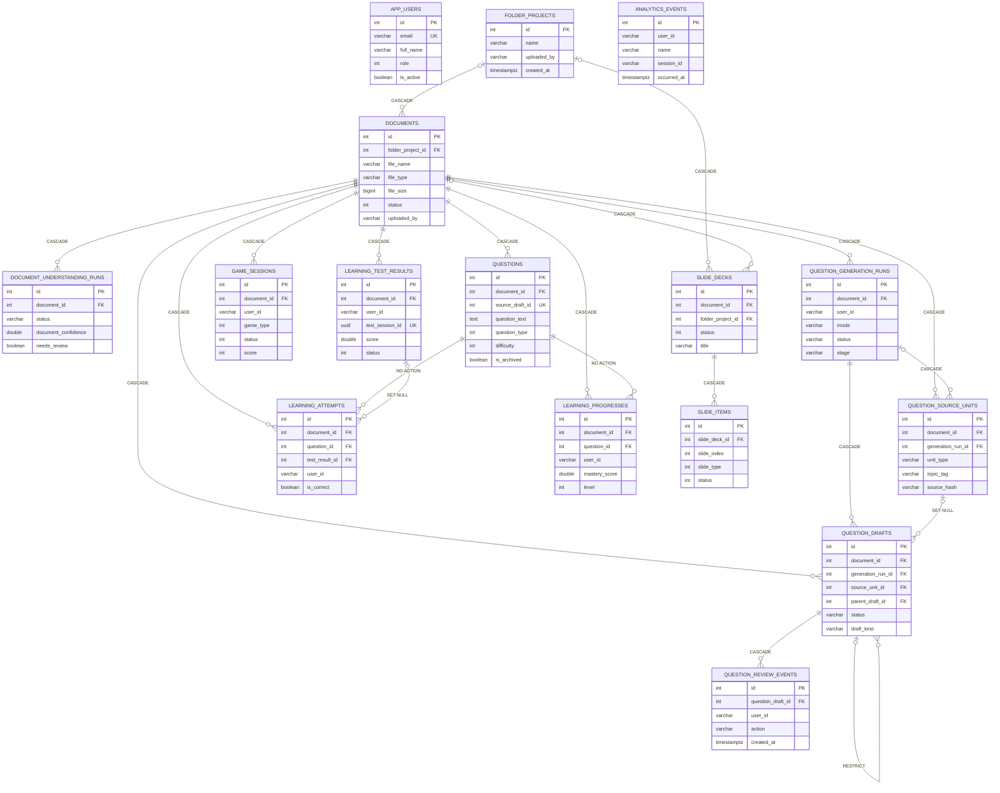
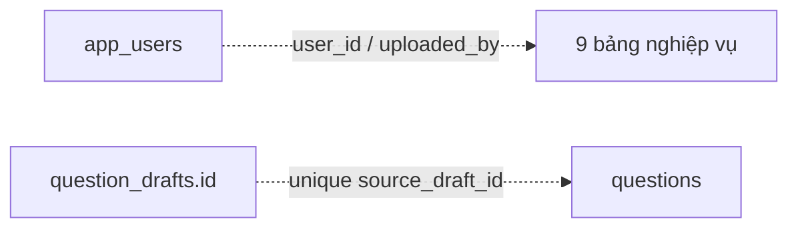

# Biểu đồ cơ sở dữ liệu PBL5

## 1. Kết luận mô hình dữ liệu

PBL5 sử dụng **cơ sở dữ liệu quan hệ PostgreSQL** thông qua Entity Framework Core và Npgsql. Mô hình chính không phải cơ sở dữ liệu phẳng. Một số thuộc tính phức tạp được nhúng dưới dạng `jsonb` hoặc chuỗi JSON trong các bảng quan hệ để lưu kết quả OCR, AI, câu hỏi, slide và analytics.

Nguồn đối chiếu theo thứ tự ưu tiên:

1. `ApplicationDbContext` và entity runtime.
2. Toàn bộ migration đã tạo schema PostgreSQL.
3. `ApplicationDbContextModelSnapshot` để kiểm tra model EF Core hiện tại.

Schema có **16 bảng**, chia thành năm nhóm:

| Nhóm | Bảng |
| --- | --- |
| Tài khoản | `app_users` |
| Workspace và tài liệu | `folder_projects`, `documents`, `document_understanding_runs` |
| Question Studio và câu hỏi | `questions`, `question_generation_runs`, `question_source_units`, `question_drafts`, `question_review_events` |
| Học tập | `game_sessions`, `learning_attempts`, `learning_progresses`, `learning_test_results` |
| Slide và analytics | `slide_decks`, `slide_items`, `analytics_events` |

## 2. Quy ước đọc

- `PK`: khóa chính.
- `FK`: khóa ngoại vật lý được PostgreSQL thực thi.
- `UQ`: ràng buộc hoặc unique index.
- `IDX`: index không duy nhất.
- `NULL`: cột cho phép rỗng.
- `NOT NULL`: cột bắt buộc.
- Các enum C# được lưu dưới dạng PostgreSQL `integer`.
- `timestamptz` là `timestamp with time zone`.
- Cả 16 bảng dùng tên khóa chính vật lý `id` chữ thường. Property C# tương ứng vẫn là `Id` theo convention .NET.

### Quan hệ vật lý và liên kết logic

Các cột `user_id` và `uploaded_by` là định danh người dùng ở tầng nghiệp vụ nhưng **không có FK** đến `app_users.id`. Kiểu dữ liệu cũng khác nhau: các cột này là `varchar(100)`, trong khi `app_users.id` là `integer`.

`questions.source_draft_id` có unique index có điều kiện khi giá trị khác `NULL`, nhưng **không có FK vật lý** đến `question_drafts.id`. Vì vậy ERD chính không vẽ nó như một quan hệ được database bảo đảm.

## 3. ERD tổng thể

Đường nối trong sơ đồ sau chỉ biểu diễn FK vật lý. Các trường JSON được rút gọn để sơ đồ dễ đọc; phần 4 liệt kê đầy đủ cột.

Liên kết logic không có FK:

## 4. Chi tiết các bảng

### 4.1 Tài khoản

#### `app_users`

Lưu tài khoản đăng nhập, vai trò và trạng thái hoạt động.

| Cột | Kiểu PostgreSQL | Ràng buộc | Ý nghĩa |
| --- | --- | --- | --- |
| `id` | `integer` | PK, identity | Mã tài khoản |
| `full_name` | `varchar(200)` | NOT NULL | Họ tên |
| `email` | `varchar(320)` | NOT NULL, UQ | Email đăng nhập |
| `password_hash` | `varchar(1000)` | NOT NULL | Mật khẩu đã băm |
| `role` | `integer` | NOT NULL, IDX | Enum `UserRole` |
| `is_active` | `boolean` | NOT NULL, IDX | Trạng thái tài khoản |
| `created_at` | `timestamptz` | NOT NULL, IDX | Thời điểm tạo |
| `updated_at` | `timestamptz` | NULL | Thời điểm cập nhật |

### 4.2 Workspace và tài liệu

#### `folder_projects`

Đại diện workspace/folder, gom nhiều tài liệu nguồn và slide deck.

| Cột | Kiểu PostgreSQL | Ràng buộc | Ý nghĩa |
| --- | --- | --- | --- |
| `id` | `integer` | PK, identity | Mã workspace |
| `name` | `varchar(240)` | NOT NULL | Tên workspace |
| `description` | `varchar(1200)` | NULL | Mô tả |
| `uploaded_by` | `varchar(100)` | NOT NULL, IDX | Định danh user logic |
| `created_at` | `timestamptz` | NOT NULL, IDX | Thời điểm tạo |
| `updated_at` | `timestamptz` | NOT NULL, IDX | Thời điểm cập nhật |

Quan hệ: một workspace có nhiều `documents` và nhiều `slide_decks`; xóa workspace sẽ cascade hai nhóm bản ghi này.

#### `documents`

Lưu file nguồn, nội dung trích xuất và kết quả phân tích AI/OCR.

| Cột | Kiểu PostgreSQL | Ràng buộc | Ý nghĩa |
| --- | --- | --- | --- |
| `id` | `integer` | PK, identity | Mã tài liệu |
| `file_name` | `varchar(500)` | NOT NULL | Tên file |
| `file_type` | `varchar(50)` | NOT NULL | PDF, DOCX, PNG, JPG... |
| `file_path` | `varchar(1000)` | NOT NULL | Đường dẫn lưu file |
| `file_size` | `bigint` | NOT NULL | Kích thước byte |
| `extracted_text` | `text` | NULL | Văn bản OCR/parser |
| `main_topics` | `jsonb` | NULL | Chủ đề chính |
| `key_points` | `jsonb` | NULL | Các ý quan trọng |
| `coverage_map` | `jsonb` | NULL | Bản đồ bao phủ nội dung |
| `processed_metadata` | `text` | NULL | Metadata JSON lưu dạng text |
| `summary` | `text` | NULL | Tóm tắt |
| `language` | `varchar(50)` | NULL | Ngôn ngữ |
| `status` | `integer` | NOT NULL, IDX | Enum `DocumentStatus` |
| `folder_project_id` | `integer` | NULL, FK, IDX | Workspace chứa tài liệu |
| `include_in_folder_slides` | `boolean` | NOT NULL | Có dùng khi tạo slide workspace |
| `folder_source_order` | `integer` | NOT NULL | Thứ tự nguồn trong workspace |
| `uploaded_by` | `varchar(100)` | NOT NULL, IDX | Định danh user logic |
| `created_at` | `timestamptz` | NOT NULL, IDX | Thời điểm tạo |
| `updated_at` | `timestamptz` | NOT NULL | Thời điểm cập nhật |

Index ghép: `(folder_project_id, folder_source_order)`.

Quan hệ cascade đến `questions`, các bảng Question Studio, `game_sessions`, `learning_attempts`, `learning_progresses`, `learning_test_results`, `slide_decks` và `document_understanding_runs`.

#### `document_understanding_runs`

Lưu từng lần chạy Document Understanding, độ tin cậy và payload kết quả.

| Cột | Kiểu PostgreSQL | Ràng buộc | Ý nghĩa |
| --- | --- | --- | --- |
| `id` | `integer` | PK, identity | Mã lần chạy |
| `document_id` | `integer` | NOT NULL, FK | Tài liệu nguồn |
| `status` | `varchar(80)` | NOT NULL | Trạng thái xử lý |
| `document_confidence` | `double precision` | NULL | Độ tin cậy tổng thể |
| `needs_review` | `boolean` | NOT NULL | Cần người dùng kiểm tra |
| `combined_text` | `text` | NULL | Văn bản kết hợp |
| `result` | `jsonb` | NULL | Kết quả hiểu tài liệu |
| `failure_reasons` | `jsonb` | NULL | Danh sách nguyên nhân lỗi |
| `created_at` | `timestamptz` | NOT NULL, IDX | Thời điểm chạy |

Index ghép: `(document_id, created_at)`. FK đến `documents` dùng `CASCADE`.

### 4.3 Question Studio và câu hỏi

#### `questions`

Lưu câu hỏi đã được nhập/xuất bản để các chế độ học sử dụng.

| Cột | Kiểu PostgreSQL | Ràng buộc | Ý nghĩa |
| --- | --- | --- | --- |
| `id` | `integer` | PK, identity | Mã câu hỏi |
| `document_id` | `integer` | NOT NULL, FK, IDX | Tài liệu nguồn |
| `question_text` | `text` | NOT NULL | Nội dung câu hỏi |
| `question_type` | `integer` | NOT NULL | Enum `QuestionType` |
| `options` | `jsonb` | NULL | Danh sách lựa chọn |
| `correct_answer` | `varchar(500)` | NULL | Đáp án đúng |
| `explanation` | `text` | NULL | Giải thích |
| `difficulty` | `integer` | NOT NULL | Enum `DifficultyLevel` |
| `topic` | `varchar(200)` | NULL | Chủ đề |
| `verifier_score` | `integer` | NULL | Điểm kiểm chứng |
| `verifier_issues` | `jsonb` | NULL | Vấn đề do verifier phát hiện |
| `source_draft_id` | `integer` | NULL, UQ có điều kiện | Liên kết logic đến draft đã nhập |
| `quality_score` | `double precision` | NULL | Điểm chất lượng |
| `is_archived` | `boolean` | NOT NULL, IDX | Giữ lịch sử khi tái sinh câu hỏi |
| `created_at` | `timestamptz` | NOT NULL | Thời điểm tạo |

Index ghép: `(document_id, question_type)`. Unique index `source_draft_id` chỉ áp dụng khi khác `NULL`; không có FK vật lý tới `question_drafts`.

#### `question_generation_runs`

Lưu job sinh câu hỏi Question Studio V2 và các số liệu tổng hợp.

| Cột | Kiểu PostgreSQL | Ràng buộc | Ý nghĩa |
| --- | --- | --- | --- |
| `id` | `integer` | PK, identity | Mã job |
| `document_id` | `integer` | NOT NULL, FK | Tài liệu nguồn |
| `user_id` | `varchar(100)` | NOT NULL | User logic |
| `mode` | `varchar(40)` | NOT NULL | Chế độ sinh |
| `status` | `varchar(40)` | NOT NULL, IDX | Trạng thái job |
| `stage` | `varchar(80)` | NOT NULL | Giai đoạn hiện tại |
| `target_draft_count` | `integer` | NOT NULL | Số draft mục tiêu |
| `generated_draft_count` | `integer` | NOT NULL | Số draft đã sinh |
| `verified_draft_count` | `integer` | NOT NULL | Số draft đã kiểm chứng |
| `imported_count` | `integer` | NOT NULL | Số draft đã nhập |
| `duplicate_count` | `integer` | NOT NULL | Số draft trùng |
| `rejected_count` | `integer` | NOT NULL | Số draft bị loại |
| `borderline_count` | `integer` | NOT NULL | Số draft sát ngưỡng |
| `quarantined_count` | `integer` | NOT NULL | Số draft cách ly |
| `requested_question_types` | `jsonb` | NOT NULL | Loại câu hỏi yêu cầu |
| `requested_difficulties` | `jsonb` | NOT NULL | Độ khó yêu cầu |
| `model_profile` | `jsonb` | NOT NULL | Cấu hình model |
| `failure_stats` | `jsonb` | NOT NULL | Thống kê lỗi |
| `metrics` | `jsonb` | NOT NULL | Metrics job |
| `error_message` | `text` | NOT NULL | Thông báo lỗi |
| `created_at` | `timestamptz` | NOT NULL | Thời điểm tạo |
| `started_at` | `timestamptz` | NULL | Thời điểm bắt đầu |
| `completed_at` | `timestamptz` | NULL | Thời điểm hoàn tất |

Index ghép: `(document_id, created_at)`. FK đến `documents` dùng `CASCADE`.

#### `question_source_units`

Lưu đoạn bằng chứng có grounding dùng để tạo draft.

| Cột | Kiểu PostgreSQL | Ràng buộc | Ý nghĩa |
| --- | --- | --- | --- |
| `id` | `integer` | PK, identity | Mã source unit |
| `document_id` | `integer` | NOT NULL, FK | Tài liệu nguồn |
| `generation_run_id` | `integer` | NULL, FK, IDX | Job đã tạo source unit |
| `unit_type` | `varchar(40)` | NOT NULL | Loại đơn vị nội dung |
| `content` | `text` | NOT NULL | Nội dung bằng chứng |
| `topic_tag` | `varchar(200)` | NOT NULL | Nhãn chủ đề |
| `source_hash` | `varchar(128)` | NOT NULL, IDX | Hash nguồn |
| `start_offset` | `integer` | NOT NULL | Vị trí bắt đầu |
| `end_offset` | `integer` | NOT NULL | Vị trí kết thúc |
| `confidence` | `double precision` | NOT NULL | Độ tin cậy |
| `metadata` | `jsonb` | NOT NULL | Metadata mở rộng |
| `created_at` | `timestamptz` | NOT NULL | Thời điểm tạo |

Index ghép: `(document_id, topic_tag)`. Cả FK tài liệu và generation run đều dùng `CASCADE`.

#### `question_drafts`

Lưu câu hỏi nháp chuẩn và biến thể trước khi nhập vào `questions`.

| Cột | Kiểu PostgreSQL | Ràng buộc | Ý nghĩa |
| --- | --- | --- | --- |
| `id` | `integer` | PK, identity | Mã draft |
| `document_id` | `integer` | NOT NULL, FK | Tài liệu nguồn |
| `generation_run_id` | `integer` | NOT NULL, FK | Job sinh draft |
| `source_unit_id` | `integer` | NULL, FK | Bằng chứng nguồn |
| `status` | `varchar(40)` | NOT NULL | Trạng thái |
| `draft_kind` | `varchar(40)` | NOT NULL | Canonical/variant |
| `parent_draft_id` | `integer` | NULL, FK tự tham chiếu | Draft cha |
| `question_text` | `text` | NOT NULL | Nội dung câu hỏi |
| `question_type` | `varchar(40)` | NOT NULL | Loại câu hỏi |
| `options` | `jsonb` | NOT NULL | Các lựa chọn |
| `correct_answer` | `text` | NOT NULL | Đáp án |
| `explanation` | `text` | NOT NULL | Giải thích |
| `difficulty` | `varchar(20)` | NOT NULL | Độ khó |
| `learning_objective` | `varchar(40)` | NOT NULL | Mục tiêu học tập |
| `topic_tag` | `varchar(200)` | NOT NULL | Chủ đề |
| `grounding_score` | `double precision` | NOT NULL | Điểm grounding |
| `answer_score` | `double precision` | NOT NULL | Điểm đáp án |
| `clarity_score` | `double precision` | NOT NULL | Điểm rõ ràng |
| `duplicate_score` | `double precision` | NOT NULL | Điểm không trùng |
| `overall_score` | `double precision` | NOT NULL | Điểm tổng |
| `repair_count` | `integer` | NOT NULL | Số lần sửa tự động |
| `failure_reason` | `text` | NOT NULL | Lý do thất bại |
| `source_evidence` | `text` | NOT NULL | Bằng chứng nguồn |
| `stem_hash` | `varchar(128)` | NOT NULL, IDX | Hash câu hỏi |
| `metadata` | `jsonb` | NOT NULL | Metadata mở rộng |
| `created_at` | `timestamptz` | NOT NULL | Thời điểm tạo |
| `verified_at` | `timestamptz` | NULL | Thời điểm kiểm chứng |
| `imported_at` | `timestamptz` | NULL | Thời điểm nhập |

Index ghép: `(document_id, status)`, `(generation_run_id, status)`, `(topic_tag, difficulty)`.

Hành vi xóa: tài liệu và generation run dùng `CASCADE`; source unit dùng `SET NULL`; draft cha dùng `RESTRICT` để không xóa draft đang có biến thể.

#### `question_review_events`

Audit log cho thao tác duyệt và chỉnh sửa draft.

| Cột | Kiểu PostgreSQL | Ràng buộc | Ý nghĩa |
| --- | --- | --- | --- |
| `id` | `integer` | PK, identity | Mã sự kiện |
| `question_draft_id` | `integer` | NOT NULL, FK, IDX | Draft được thao tác |
| `user_id` | `varchar(100)` | NOT NULL | User logic |
| `action` | `varchar(40)` | NOT NULL, IDX | Loại thao tác |
| `before` | `jsonb` | NOT NULL | Snapshot trước |
| `after` | `jsonb` | NOT NULL | Snapshot sau |
| `note` | `text` | NOT NULL | Ghi chú |
| `created_at` | `timestamptz` | NOT NULL | Thời điểm thao tác |

Index ghép: `(question_draft_id, created_at)`. FK đến draft dùng `CASCADE`.

### 4.4 Học tập

#### `game_sessions`

Lưu trạng thái tổng hợp của phiên Quiz, Flashcard hoặc Test.

| Cột | Kiểu PostgreSQL | Ràng buộc | Ý nghĩa |
| --- | --- | --- | --- |
| `id` | `integer` | PK, identity | Mã phiên |
| `document_id` | `integer` | NOT NULL, FK, IDX | Tài liệu học |
| `game_type` | `integer` | NOT NULL | Enum `GameType` |
| `user_id` | `varchar(100)` | NOT NULL, IDX | User logic |
| `question_ids` | `jsonb` | NULL | Danh sách mã câu hỏi |
| `score` | `integer` | NOT NULL | Điểm |
| `total_questions` | `integer` | NOT NULL | Tổng câu |
| `correct_answers` | `integer` | NOT NULL | Số câu đúng |
| `status` | `integer` | NOT NULL | Enum `GameStatus` |
| `started_at` | `timestamptz` | NULL | Bắt đầu |
| `completed_at` | `timestamptz` | NULL | Hoàn tất |
| `created_at` | `timestamptz` | NOT NULL | Tạo phiên |

Index ghép: `(user_id, created_at)`. FK đến `documents` dùng `CASCADE`.

#### `learning_attempts`

Mỗi dòng là một lần người học trả lời một câu hỏi.

| Cột | Kiểu PostgreSQL | Ràng buộc | Ý nghĩa |
| --- | --- | --- | --- |
| `id` | `integer` | PK, identity | Mã lượt trả lời |
| `user_id` | `varchar(100)` | NOT NULL, IDX | User logic |
| `document_id` | `integer` | NOT NULL, FK, IDX | Tài liệu |
| `question_id` | `integer` | NOT NULL, FK, IDX | Câu hỏi |
| `mode` | `integer` | NOT NULL | Enum `LearningMode` |
| `selected_answer` | `varchar(1000)` | NULL | Đáp án đã chọn |
| `is_correct` | `boolean` | NOT NULL | Đúng/sai |
| `confidence` | `varchar(40)` | NULL | Mức tự tin |
| `response_time_ms` | `integer` | NULL | Thời gian trả lời |
| `test_result_id` | `integer` | NULL, FK, IDX | Phiên test liên quan |
| `created_at` | `timestamptz` | NOT NULL | Thời điểm trả lời |

Index ghép: `(user_id, document_id, question_id)` và `(user_id, document_id, created_at)`.

Hành vi xóa: document dùng `CASCADE`, question dùng `NO ACTION`, test result dùng `SET NULL`.

#### `learning_progresses`

Lưu trạng thái thành thạo tổng hợp trên từng câu hỏi của từng người học.

| Cột | Kiểu PostgreSQL | Ràng buộc | Ý nghĩa |
| --- | --- | --- | --- |
| `id` | `integer` | PK, identity | Mã tiến độ |
| `user_id` | `varchar(100)` | NOT NULL, IDX | User logic |
| `document_id` | `integer` | NOT NULL, FK, IDX | Tài liệu |
| `question_id` | `integer` | NOT NULL, FK, IDX | Câu hỏi |
| `attempt_count` | `integer` | NOT NULL | Tổng lượt |
| `correct_count` | `integer` | NOT NULL | Tổng đúng |
| `wrong_count` | `integer` | NOT NULL | Tổng sai |
| `current_streak` | `integer` | NOT NULL | Chuỗi đúng hiện tại |
| `best_streak` | `integer` | NOT NULL | Chuỗi đúng tốt nhất |
| `last_reviewed_at` | `timestamptz` | NULL | Ôn gần nhất |
| `memory_score` | `double precision` | NOT NULL | Điểm ghi nhớ |
| `mastery_score` | `double precision` | NOT NULL | Điểm thành thạo |
| `level` | `integer` | NOT NULL | Enum `LearningLevel` |
| `updated_at` | `timestamptz` | NOT NULL | Cập nhật gần nhất |

UQ ghép: `(user_id, document_id, question_id)`. Document dùng `CASCADE`; question dùng `NO ACTION`.

#### `learning_test_results`

Lưu kết quả và snapshot của một phiên kiểm tra.

| Cột | Kiểu PostgreSQL | Ràng buộc | Ý nghĩa |
| --- | --- | --- | --- |
| `id` | `integer` | PK, identity | Mã kết quả |
| `user_id` | `varchar(100)` | NOT NULL, IDX | User logic |
| `document_id` | `integer` | NOT NULL, FK, IDX | Tài liệu |
| `total_questions` | `integer` | NOT NULL | Tổng câu |
| `correct_count` | `integer` | NOT NULL | Số đúng |
| `wrong_count` | `integer` | NOT NULL | Số sai |
| `score` | `double precision` | NOT NULL | Điểm |
| `started_at` | `timestamptz` | NOT NULL | Bắt đầu |
| `submitted_at` | `timestamptz` | NOT NULL, IDX | Nộp bài |
| `duration_ms` | `bigint` | NOT NULL | Thời lượng |
| `test_type` | `integer` | NOT NULL, IDX | Enum `LearningTestType` |
| `test_session_id` | `uuid` | NOT NULL, UQ | ID phiên ổn định |
| `status` | `integer` | NOT NULL, IDX | Enum trạng thái |
| `question_ids` | `jsonb` | NULL | Danh sách câu hỏi |
| `result_snapshot` | `jsonb` | NULL | Snapshot kết quả |
| `created_at` | `timestamptz` | NOT NULL | Thời điểm tạo |

Index ghép: `(user_id, document_id)` và `(user_id, document_id, submitted_at)`. FK tài liệu dùng `CASCADE`.

### 4.5 Slide và analytics

#### `slide_decks`

Lưu deck được tạo từ một tài liệu hoặc từ một workspace.

| Cột | Kiểu PostgreSQL | Ràng buộc | Ý nghĩa |
| --- | --- | --- | --- |
| `id` | `integer` | PK, identity | Mã deck |
| `document_id` | `integer` | NULL, FK, IDX | Nguồn tài liệu đơn |
| `folder_project_id` | `integer` | NULL, FK, IDX | Nguồn workspace |
| `status` | `integer` | NOT NULL, IDX | Enum `SlideDeckStatus` |
| `title` | `varchar(240)` | NULL | Tiêu đề |
| `subtitle` | `varchar(400)` | NULL | Tiêu đề phụ |
| `theme_key` | `varchar(80)` | NULL | Theme |
| `outline` | `jsonb` | NULL | Dàn ý |
| `created_at` | `timestamptz` | NOT NULL | Thời điểm tạo |
| `updated_at` | `timestamptz` | NOT NULL | Thời điểm cập nhật |
| `completed_at` | `timestamptz` | NULL | Hoàn tất |

Index ghép: `(document_id, created_at)` và `(folder_project_id, created_at)`. Cả hai FK nguồn dùng `CASCADE`; ứng dụng cần bảo đảm deck có nguồn phù hợp vì database không có check constraint yêu cầu đúng một trong hai cột.

#### `slide_items`

Lưu từng slide theo thứ tự, nội dung, bằng chứng, hình ảnh và trạng thái editor.

| Cột | Kiểu PostgreSQL | Ràng buộc | Ý nghĩa |
| --- | --- | --- | --- |
| `id` | `integer` | PK, identity | Mã slide |
| `slide_deck_id` | `integer` | NOT NULL, FK, IDX | Deck cha |
| `slide_index` | `integer` | NOT NULL | Thứ tự slide |
| `slide_type` | `integer` | NOT NULL | Enum `SlideItemType` |
| `status` | `integer` | NOT NULL, IDX | Enum `SlideItemStatus` |
| `heading` | `varchar(240)` | NULL | Tiêu đề |
| `subheading` | `varchar(400)` | NULL | Tiêu đề phụ |
| `goal` | `varchar(400)` | NULL | Mục tiêu giảng dạy |
| `key_message` | `varchar(400)` | NULL | Thông điệp chính |
| `body` | `jsonb` | NULL | Nội dung có cấu trúc |
| `evidence_from_text` | `text` | NULL | Bằng chứng nguồn |
| `editor_state` | `jsonb` | NULL | Trạng thái trình sửa |
| `speaker_notes` | `text` | NULL | Ghi chú thuyết trình |
| `accent_tone` | `varchar(80)` | NULL | Tông nhấn |
| `verifier_score` | `integer` | NULL | Điểm kiểm chứng |
| `verifier_issues` | `jsonb` | NULL | Vấn đề kiểm chứng |
| `image_plan` | `jsonb` | NULL | Kế hoạch hình ảnh |
| `image_candidates` | `jsonb` | NULL | Ứng viên hình ảnh |
| `evidence_debug` | `text` | NULL | JSON/debug lưu dạng text |
| `selected_image_key` | `varchar(160)` | NULL | Hình đã chọn |
| `created_at` | `timestamptz` | NOT NULL | Thời điểm tạo |
| `updated_at` | `timestamptz` | NOT NULL | Thời điểm cập nhật |

Index ghép `(slide_deck_id, slide_index)` hiện không unique. FK đến deck dùng `CASCADE`.

Các thuộc tính runtime `Rhythm`, `VisualRole`, `ChartIntent`, `NeedsChartReview` có `[NotMapped]`, vì vậy không phải cột database.

#### `analytics_events`

Lưu sự kiện analytics dạng append-only.

| Cột | Kiểu PostgreSQL | Ràng buộc | Ý nghĩa |
| --- | --- | --- | --- |
| `id` | `integer` | PK, identity | Mã sự kiện |
| `user_id` | `varchar(100)` | NOT NULL, IDX | User logic |
| `name` | `varchar(120)` | NOT NULL, IDX | Tên sự kiện |
| `properties_json` | `jsonb` | NOT NULL | Thuộc tính sự kiện |
| `session_id` | `varchar(120)` | NULL | Mã phiên logic |
| `occurred_at` | `timestamptz` | NOT NULL | Lúc sự kiện xảy ra |
| `received_at` | `timestamptz` | NOT NULL, IDX | Lúc server nhận |

Index ghép: `(user_id, received_at)`. Bảng không có FK vật lý.

## 5. Ma trận quan hệ và hành vi xóa

| Bảng cha | Bảng con | FK | Cardinality | Khi xóa cha |
| --- | --- | --- | --- | --- |
| `folder_projects` | `documents` | `folder_project_id` NULL | 1 - 0..N | `CASCADE` |
| `folder_projects` | `slide_decks` | `folder_project_id` NULL | 1 - 0..N | `CASCADE` |
| `documents` | `document_understanding_runs` | `document_id` | 1 - 0..N | `CASCADE` |
| `documents` | `questions` | `document_id` | 1 - 0..N | `CASCADE` |
| `documents` | `question_generation_runs` | `document_id` | 1 - 0..N | `CASCADE` |
| `documents` | `question_source_units` | `document_id` | 1 - 0..N | `CASCADE` |
| `documents` | `question_drafts` | `document_id` | 1 - 0..N | `CASCADE` |
| `question_generation_runs` | `question_source_units` | `generation_run_id` NULL | 1 - 0..N | `CASCADE` |
| `question_generation_runs` | `question_drafts` | `generation_run_id` | 1 - 0..N | `CASCADE` |
| `question_source_units` | `question_drafts` | `source_unit_id` NULL | 1 - 0..N | `SET NULL` |
| `question_drafts` | `question_drafts` | `parent_draft_id` NULL | 1 - 0..N | `RESTRICT` |
| `question_drafts` | `question_review_events` | `question_draft_id` | 1 - 0..N | `CASCADE` |
| `documents` | `game_sessions` | `document_id` | 1 - 0..N | `CASCADE` |
| `documents` | `learning_attempts` | `document_id` | 1 - 0..N | `CASCADE` |
| `questions` | `learning_attempts` | `question_id` | 1 - 0..N | `NO ACTION` |
| `documents` | `learning_progresses` | `document_id` | 1 - 0..N | `CASCADE` |
| `questions` | `learning_progresses` | `question_id` | 1 - 0..N | `NO ACTION` |
| `documents` | `learning_test_results` | `document_id` | 1 - 0..N | `CASCADE` |
| `learning_test_results` | `learning_attempts` | `test_result_id` NULL | 1 - 0..N | `SET NULL` |
| `documents` | `slide_decks` | `document_id` NULL | 1 - 0..N | `CASCADE` |
| `slide_decks` | `slide_items` | `slide_deck_id` | 1 - 0..N | `CASCADE` |

## 6. Dữ liệu bán cấu trúc

### `jsonb`

PostgreSQL kiểm tra cú pháp JSON và hỗ trợ toán tử/truy vấn JSON. Các cột chính:

- Tài liệu: `main_topics`, `key_points`, `coverage_map`.
- Document Understanding: `result`, `failure_reasons`.
- Question Studio: options, yêu cầu generation, metrics, metadata, audit snapshots.
- Học tập: danh sách câu hỏi và snapshot kết quả.
- Slide: outline, body, editor state, verifier issues và image pipeline.
- Analytics: `properties_json`.

### JSON lưu trong `text`

`documents.processed_metadata` và `slide_items.evidence_debug` được code xử lý như JSON nhưng cột vật lý là `text`. Database không kiểm tra cú pháp JSON cho hai cột này.

## 7. Mô hình phẳng gợi ý cho báo cáo/CSV

Đây là lớp xuất dữ liệu phục vụ BI hoặc báo cáo, **không thay thế schema runtime**.

### `document_report.csv`

Một dòng cho mỗi tài liệu:

`document_id`, `workspace_id`, `workspace_name`, `file_name`, `file_type`, `file_size`, `language`, `status`, `uploaded_by`, `created_at`, `question_count`, `slide_deck_count`, `understanding_run_count`.

### `question_quality_report.csv`

Một dòng cho mỗi câu hỏi hoặc draft:

`document_id`, `generation_run_id`, `draft_id`, `published_question_id`, `topic`, `question_type`, `difficulty`, `status`, `grounding_score`, `answer_score`, `clarity_score`, `duplicate_score`, `overall_score`, `verifier_score`, `created_at`.

### `learning_attempt_report.csv`

Một dòng cho mỗi lượt trả lời:

`attempt_id`, `user_id`, `document_id`, `question_id`, `test_session_id`, `mode`, `selected_answer`, `is_correct`, `confidence`, `response_time_ms`, `attempted_at`.

### `slide_report.csv`

Một dòng cho mỗi slide:

`deck_id`, `document_id`, `workspace_id`, `deck_status`, `slide_id`, `slide_index`, `slide_type`, `slide_status`, `heading`, `verifier_score`, `selected_image_key`, `updated_at`.

Khi xuất CSV, mảng hoặc object JSON nên được chuẩn hóa thành cột tổng hợp hoặc chuỗi JSON; không nhân bản toàn bộ `extracted_text`, `combined_text` hay payload debug nếu báo cáo không cần.

## 8. Ghi chú kỹ thuật về khóa chính

Migration `NormalizePrimaryKeyColumnNames` đổi 11 khóa chính cũ từ `"Id"` sang `id` bằng thao tác rename, không tạo lại bảng và không thay đổi dữ liệu, identity hay quan hệ khóa ngoại. Bốn bảng Question Studio V2 và `analytics_events` đã dùng `id` từ trước. `ApplicationDbContextModelSnapshot` sau migration chứa đủ 16 bảng.

## 9. Tệp DBML

Tệp `schema.dbml` chứa đầy đủ 16 bảng, cột, index và FK để nhập vào [dbdiagram.io](https://dbdiagram.io/). Các liên kết logic không có FK được ghi bằng `Note`, không khai báo bằng `Ref`.