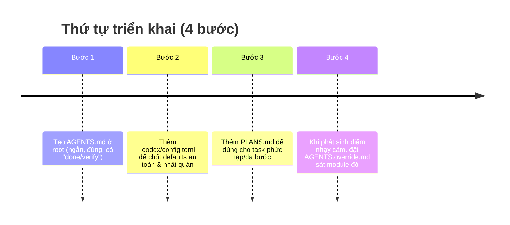

# Các file tối thiểu trong repo để điều khiển agent và giảm ảo giác

Một bộ file điều khiển agent hiệu quả thường xoay quanh **hướng dẫn bền vững** (AGENTS.md), **cấu hình hành vi nhất quán** (.codex/config.toml), và **cơ chế “đúng lúc mới nạp”** (tách override theo thư mục, chỉ bổ sung khi cần). Tài liệu chính thức nhấn mạnh: **file hướng dẫn nên ngắn, thực dụng**, và chỉ thêm quy tắc khi đã thấy lỗi lặp lại; nhồi quá nhiều yêu cầu có thể làm tăng chi phí và giảm hiệu quả. citeturn10view0turn1view1turn0academia36

## Cơ sở bằng chứng từ tài liệu entity["company","OpenAI","ai research company"] về Codex

Codex đọc hướng dẫn dự án theo cơ chế **phân lớp**: mỗi thư mục có thể có tối đa một file hướng dẫn (ưu tiên `AGENTS.override.md` rồi `AGENTS.md`), và các file được **ghép từ root xuống thư mục làm việc**, file “gần” hơn sẽ nằm sau và có tác dụng override. Có giới hạn dung lượng tổng (mặc định 32 KiB) và nên **tách nhỏ** thay vì phình một file. citeturn1view1turn3view2

Về nội dung, tài liệu best-practices khuyến nghị `AGENTS.md` tập trung vào các thứ agent khó tự suy ra: bố cục repo, cách chạy, lệnh build/test/lint, quy ước kỹ thuật, “do-not rules”, và định nghĩa “done/verify”; đồng thời nhấn mạnh **ngắn + chính xác > dài + mơ hồ**. citeturn10view0

Về cấu hình, Codex hỗ trợ file cấu hình theo project trong `.codex/config.toml` (chỉ load khi project được trust), để cố định các mặc định như model, reasoning, approval/sandbox, MCP… giúp hành vi ổn định giữa các phiên và bề mặt (CLI/IDE/App). citeturn2view2turn2view3turn10view0

Cuối cùng, có bằng chứng nghiên cứu (2026) cho thấy **context files nếu chứa yêu cầu thừa có thể làm giảm tỷ lệ hoàn thành và tăng chi phí inference đáng kể**, nên ưu tiên “tối thiểu cần thiết”. citeturn0academia36

## Bộ bốn file tối thiểu khuyến nghị

Bộ 4 file tối thiểu (thiên về **giảm ảo giác + tiết kiệm token**) là: `AGENTS.md` (root), `.codex/config.toml` (root), `PLANS.md` (root), và `AGENTS.override.md` (chỉ đặt trong các thư mục nhạy cảm/đặc thù khi phát sinh). Bộ này bám sát khuyến nghị “guidance ngắn, phân lớp theo thư mục, plan trước khi code cho task khó, cấu hình nhất quán”. citeturn10view0turn1view1turn2view2

## Danh mục file chính để điều khiển agent

| Tên file | Vị trí đề xuất (root/thu_mục) | Nội dung cốt lõi (1-2 dòng) | Mục đích chính (1 dòng) |
|---|---|---|---|
| `AGENTS.md` | root | Layout repo quan trọng; cách chạy; build/test/lint; conventions; “do-not rules”; “done/verify”. citeturn10view0 | Neo “nguồn sự thật vận hành” để agent bớt tự suy diễn/hallucinate. |
| `.codex/config.toml` | root (`.codex/`) | Default an toàn & nhất quán (model/reasoning/approval/sandbox/MCP); có thể chỉnh giới hạn/chiến lược load hướng dẫn theo project. citeturn2view2turn10view0turn3view2 | Ổn định hành vi giữa phiên & giảm rủi ro do config mỗi người mỗi kiểu. |
| `PLANS.md` | root | Template kế hoạch thực thi ngắn cho task phức tạp (mục tiêu/phạm vi/rủi ro/verify), dùng khi yêu cầu mơ hồ hoặc nhiều bước. citeturn10view0 | Ép “plan trước khi code” để giảm sai hướng và giảm vòng lặp sửa. |
| `AGENTS.override.md` | thu_mục (đặt sát module nhạy cảm) | Quy tắc/lệnh test/constraints riêng cho module; override `AGENTS.md` cùng thư mục (nếu có). citeturn1view1 | Localize hướng dẫn: đúng chỗ–đúng lúc, tránh phình file global và giảm nhầm lẫn theo ngữ cảnh. |
| `AGENTS.md` (theo thư mục) | thu_mục (khi không cần override) | Hướng dẫn cục bộ cho module (khi không dùng `AGENTS.override.md`), ngắn và cụ thể. citeturn1view1turn10view0 | Tăng độ chính xác ở monorepo/đa module mà không tăng token cho phần không liên quan. |
| `SKILL.md` | thu_mục (repo: `.agents/skills/<skill>/`) hoặc root (`.agents/skills/`) | Gói workflow lặp lại (metadata + hướng dẫn); Codex dùng “progressive disclosure”: nạp metadata trước, chỉ nạp đầy đủ khi kích hoạt. citeturn8view0turn10view0 | Giảm token so với prompt dài lặp lại, tăng độ ổn định cho SOP. |
| `.codex/agents/*.toml` | root (`.codex/agents/`) | Định nghĩa custom subagent (name/description/developer_instructions; tuỳ chọn model, MCP, skills…). citeturn2view0 | Chuyên môn hoá vai trò (explore/implement/review) nhưng chỉ nên dùng khi thật cần để tránh overhead. |
| `.codex/hooks.json` | root (`.codex/`) | Hook chạy script/validator theo vòng đời (pre/post/stop…) khi bật feature; dùng để enforce kiểm tra/chuẩn hoá. citeturn5view1turn2view3 | Thêm “rail” mang tính quyết định (deterministic) khi chất lượng phụ thuộc vào check tự động. |
| `.codex/rules/*.rules` | root (`.codex/rules/`) | Rule kiểm soát command được phép chạy ngoài sandbox (prompt/allow/forbidden), có ví dụ match/not_match. citeturn5view0turn7view0 | Giảm rủi ro thao tác lệnh nguy hiểm và ép agent xin quyền ở đúng điểm. |

## Thứ tự triển khai

## Giả định và phạm vi

Ngôn ngữ code và stack **không xác định**; repo có thể là frontend hoặc fullstack nên các file trên được mô tả theo “mục đích/điều khiển hành vi” thay vì ràng vào một framework cụ thể. Cách đặt file `SKILL.md` theo repo ưu tiên `.agents/skills/` theo tài liệu skills/best-practices; nếu tổ chức bạn chuẩn hoá theo Team Config trong `.codex/`, vẫn có thể quản trị đồng bộ config/rules/skills dưới `.codex/` theo hướng dẫn enterprise, nhưng nguyên tắc tối ưu vẫn là: **ít, đúng, cục bộ hoá theo thư mục, thêm dần theo lỗi lặp lại**. citeturn8view0turn7view0turn10view0turn0academia36